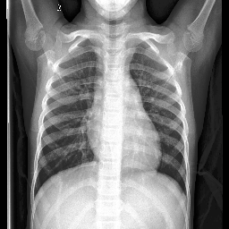

<html lang="en">
<head>
    <meta charset="UTF-8">
    <meta name="viewport" content="width=device-width, initial-scale=1.0">
    <meta name="description" content="Personal portfolio showcasing my projects and skills.">
    <link rel="stylesheet" href="assets/styles.css">
    
    <title>Portfolio</title>
</head>
<body>
    <!-- Header Section -->
    <header class="header">
        <h1><i class="fas fa-user-circle"></i>Data Science and Machine Learning Portfolio</h1>
    </header>

    <!-- About Section -->
  <section class="plaque about">
        

            
            

                <h2>About Me</h2>
                

                    I am an undergraduate in Mathematics with a solid foundation in Physics, Machine Learning, and Life Sciences. Inspired by my parents’ contributions to the Human Genome Project, I cultivated a deep passion for science, which later evolved into a keen interest in applying data science to interdisciplinary challenges.
                

                

                    Currently, I work as a consultant for a life science marketing company that provides marketing services and event management to genomics companies. My role spans diverse responsibilities, including webinar management and production, market research, and <strong>data analysis</strong>. This experience has deepened my understanding of the life sciences industry while honing my analytical and organizational skills.
                

                

                    My journey into machine learning stems from a strong grounding in applied mathematics during my Further Mathematics A-Level, and carried forward into diverse, hands-on projects. These include <strong>bioinformatics</strong>, <strong>image classification</strong>, and sentiment analysis, where I leveraged my expertise in <strong>Python</strong> and key libraries such as <strong>Pandas</strong>, <strong>Scikit-learn</strong>, <strong>TensorFlow</strong>/Keras, NumPy, SciPy, and Matplotlib.
                

                

                    I am enthusiastic about opportunities to integrate my analytical and technical skills in collaborative environments, particularly those that connect data science with other fields. My goal is to contribute to innovative solutions at the intersection of technology, mathematics, and the sciences.
                

            

        

    </section>

    <!-- Skills Section -->
<section class="plaque">
        <h2><i class="fas fa-tools"></i> Skills</h2>
        

            <button class="collapsible-btn">Technical Skills</button>
            

                <ul>
                    <li><strong>Statistical Analysis and Data Visualisation</strong></li>
                    <li><strong>Regression and Supervised/Unsupervised Machine Learning</strong></li>
                    <li><strong>Deep Learning</strong></li>
                    <li>Discrete Mathematics and Optimisation Algorithms</li>
                    <li>Computational Methods</li>
                    <li>Mathematical Modelling</li>
                </ul>
            

            <button class="collapsible-btn">Programming Languages</button>
            

                <ul>
                    <li><strong>Python</strong></li>
                    <li>R</li>
                    <li>SQL</li>
                    <li>MATLAB</li>
                </ul>
            

            <button class="collapsible-btn">Soft Skills</button>
            

                <ul>
                    <li>Team Coordination</li>
                    <li>Client Communication</li>
                    <li>Problem Solving</li>
                    <li>Effective Communication</li>
                </ul>
            

            <button class="collapsible-btn">Languages</button>
            

                <ul>
                    <li>English (Native)</li>
                    <li>Spanish (B2)</li>
                    <li>French (A2)</li>
                </ul>
            

        

    </section>

        <!-- Projects Section -->
  <section class="plaque">
        <h2><i class="fas fa-tasks"></i> Projects</h2>
        <article class="project-item">
            
            

                <h3><i class="fas fa-x-ray"></i> X-Ray Multi-Class Classification</h3>
                

                <strong>Technologies Used:</strong> Python, TensorFlow, Keras.
            

                
This project focuses on multi-class classification of X-ray images using deep learning techniques.

                <button class="open-modal-btn" data-modal="project-modal-1">View Details</button>
            

        </article>
    </section>

    <!-- Modal -->
 

        

            &times;
            <section class="plaque">
    <h1>Multi-Class Image Classification for X-rays</h1>
    

        This project was aimed at developing a machine learning model to assist doctors in diagnosing illnesses affecting patients' lungs. Using a dataset of labelled X-ray scans—categorised into pneumonia, COVID-19, or no illness—I constructed a multi-class classification model using a Convolutional Neural Network. The model outputs a diagnosis based on an input X-ray scan by leveraging tools like TensorFlow/Keras and various preprocessing, training, and evaluation techniques.
    

    <h2>Data Preparation and Preprocessing</h2>
    

        The dataset comprised greyscale X-ray lung scans, an important consideration when preprocessing the data for neural network training. Grayscale images reduce the computational overhead compared to RGB images, but the large integer pixel values (0–255) posed a challenge for efficient learning. To address this, pixel values were normalised to a 0–1 range, ensuring faster convergence and improved numerical stability during training.
    

    

        Additionally, image augmentation techniques such as flipping, rotation, and zooming were applied to enhance the dataset's variability and improve the model's generalisation to unseen data. Images were also resized and reshaped to ensure compatibility with the neural network input shape, allowing seamless feeding of data into the model.
    

    

        The dataset was split into training, validation, and testing sets, and the batch size parameter was varied during experiments. The batch size balances computational efficiency with gradient estimation quality: smaller batches speed up training but add variance to the learning curve, while larger batches provide smoother learning at the cost of higher computational demands.
    

   <h2>Model Design and Architecture</h2>
    

        The model was designed as a sequential CNN architecture using Keras. Convolutional layers served as the backbone of the network, leveraging their ability to detect local patterns in image data, such as edges and objects. This approach was particularly effective because convolution operations reduce the size of input images while preserving critical features, enabling the model to focus on meaningful spatial patterns.
    

    

        Max-pooling layers were incorporated to further reduce dimensionality, ensuring computational efficiency while retaining essential information. Dense layers processed the extracted features to classify the input image into one of the three categories. The final output layer used a softmax activation function, converting the model’s predictions into probabilities for each class.
    

    

        To prevent overfitting, dropout layers were added, randomly setting a percentage of layer outputs to zero during training. This technique, which smooths out the learning curve, was critical for improving the model’s generalisation to validation and test data.
    

    
Key parameters included:

    <ul>
        <li><strong>Loss Function</strong>: Categorical cross-entropy measured the divergence between the predicted and actual distributions, suitable for multi-class classification tasks.</li>
        <li><strong>Optimiser</strong>: The Adam optimiser, with its adaptive learning rate, was employed to balance computational efficiency and gradient descent performance.</li>
        <li><strong>Batch Size</strong>: Experimentation with different batch sizes allowed the balancing of computational cost and gradient estimation quality.</li>
        <li><strong>Early Stopping</strong>: To avoid overfitting, the training process used early stopping, halting once the validation performance plateaued or degraded.</li>
    </ul>

   

   <h2>Training and Evaluation</h2>
    

        The training process involved running the model over multiple epochs, where each epoch represented one complete pass through the dataset. To prevent overfitting, the number of epochs was determined dynamically using early stopping, ensuring training stopped when validation performance no longer improved. This technique also reduced unnecessary computation and improved training efficiency.
    

    

        Evaluation metrics, including accuracy and AUC, were tracked across training and validation datasets to monitor performance over time. Accuracy provided a straightforward measure of correct predictions, while AUC assessed the model’s ability to distinguish between classes. These metrics were plotted using Matplotlib, allowing for visualisation of model performance.
    

     
    

        The model achieved approximately 76% accuracy on the test set, demonstrating a solid baseline for multi-class classification. Analysis of precision, recall, and F1 scores through classification reports highlighted areas for improvement and a confusion matrix visualised patterns of misclassification.
    

    

        Though it was shown by the F1 scores that “Normal” X-rays were less accurately diagnosed compared to others, contextually this is less important than a healthy diagnosis for a patient who is actually sick. Being able to reliably flag patients for disease allows for more efficient work by busy radiologists.
    

  

   <h2>Challenges and Solutions</h2>
    

        The project encountered typical challenges in machine learning, particularly related to data and model optimisation.
    

    <ul>
        <li><strong>Overfitting</strong>: The model initially performed well on training data but struggled with validation data. Regularisation techniques, namely dropout layers, mitigated overfitting. Early stopping further ensured training ceased when performance plateaued.</li>
        <li><strong>Efficiency</strong>: The initial model with three layers trained on too many parameters, leading to higher risk overfitting and longer model training. To combat this, convolutional and max pooling layers were implemented to reduce parameters and increase computational efficiency.</li>
    </ul>

  

  <h2>Insights and Takeaways</h2>
    

        This project offered insights into the practical application of machine learning for medical imaging. The process emphasised the importance of careful data preparation, from normalisation to augmentation, to ensure model readiness. The design and training of the CNN provided valuable experience in leveraging convolutional layers for image feature extraction. Experimenting with parameters such as batch size and regularisation techniques solidified my understanding of how these factors influence model performance.
    

    

        Visualisation tools like loss and accuracy plots and confusion matrices proved invaluable for evaluating the model's performance and diagnosing issues like overfitting and misclassification. This iterative approach to refinement ensured that the model could generalise effectively to unseen data.
    

   

   <h2>Future Directions</h2>
    

        Future improvements to the model could be implemented by expanding the dataset to include more diverse and balanced samples which would further enhance generalisation and robustness. Additionally, hyperparameter optimisation techniques, such as grid search or Bayesian optimisation, could refine model performance and efficiency.
    

</section>

    <!-- Education Section -->
<section class="plaque">
        <h2><i class="fas fa-graduation-cap"></i> Education</h2>
        <h3>BSc, Mathematics</h3>
        
<em>Loughborough University, UK</em> (2021–2024)

        

            

                <h4>Statistics for Large Data</h4>
                
Advanced methods for analyzing and interpreting big datasets.

            

            

                <h4>Linear Algebra</h4>
                
Foundational mathematical concepts for computational modeling.

            

            

                <h4>Graph Theory</h4>
                
Exploring strategic interactions and decision-making in competitive and cooperative environments.

            

            

                <h4>Operational Research</h4>
                
Applying mathematical techniques to optimize processes and decision-making in complex systems.

            

            

                <h4>Probability Theory</h4>
                
Advanced concepts in probability and stochastic processes.

            

            

                <h4>Mathematical Biology</h4>
                
Modeling biological systems using mathematical frameworks to study dynamics and patterns.

            

            

                <h4>Game Theory</h4>
                
Exploring strategic interactions and decision-making in competitive and cooperative environments.

            

            

                <h4>Communicating Mathematics</h4>
                
Communicating complex mathematical concepts in an easy-to-digest presentation.

            

        

    </section>

<a href="https://github.com/ReeceBrooking/ReeceBrooking.github.io/tree/main/x-ray-classification" target="_blank" class="modal-link">
                View on GitHub <i class="fas fa-external-link-alt"></i>
            </a>
        

    

    <!-- Footer -->
 <footer>
        
<a href="https://github.com/ReeceBrooking/ReeceBrooking.github.io"><i class="fab fa-github"></i> GitHub</a> | <a href="https://www.linkedin.com/in/reece-brooking-371b0730a/"><i class="fab fa-linkedin"></i> LinkedIn</a>

    </footer>

    <!-- JavaScript -->
 
</body>
</html>
